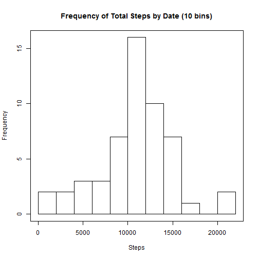
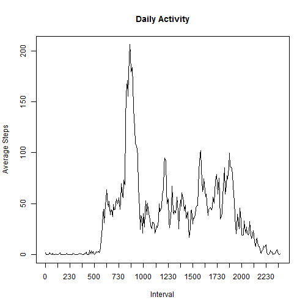
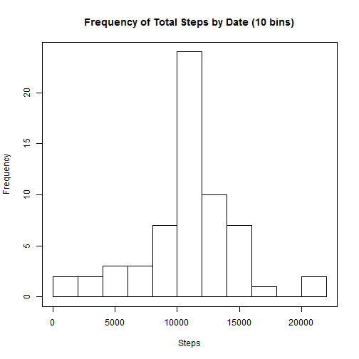
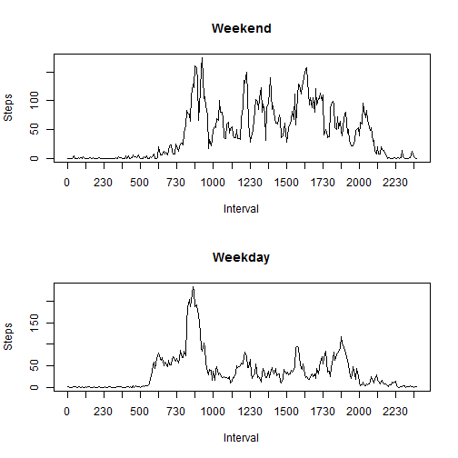

# Reproducible Research: Peer Assessment 1


## Loading and preprocessing the data

```r
activity = read.csv("./Activity/activity.csv", stringsAsFactors = FALSE)
activity$date = as.Date(activity$date)
cmpactivity = activity[complete.cases(activity), ]
```


## What is mean total number of steps taken per day?

The following histogram shows the sum of steps by date.

```r
aggStepsByDate = aggregate(steps ~ date, cmpactivity, FUN = sum)
hist(aggStepsByDate$steps, plot = TRUE, breaks = 10, xlab = "Steps", main = "Frequency of Total Steps by Date (10 bins)")
box()
```

 

```r
meanSteps = format(mean(aggStepsByDate$steps), nsmall = 1)
medianSteps = format(median(aggStepsByDate$steps), nsmall = 1)
```

The mean total number of steps per day is 10766.2.
The median total number of steps per day is 10765.
## What is the average daily activity pattern?
The following plots average steps per interval.

```r
avgSteps = aggregate(steps ~ interval, cmpactivity, FUN = mean)
colnames(avgSteps) <- c("interval", "avgsteps")
xax = 1:length(avgSteps$interval)
xaxtick = seq(1, length(avgSteps$interval), 15)
xaxlabels = avgSteps$interval[xaxtick]

plot(xax, avgSteps$avgsteps, type = "l", main = "Daily Activity", xlab = "Interval", 
    ylab = "Average Steps", axes = FALSE)
axis(1, at = xaxtick, labels = xaxlabels)
axis(2)
box()
```

 

```r

maxSteps = avgSteps[which.max(avgSteps$avgsteps), "interval"]
```

The interval with the maxium number f steps is 835

## Imputing missing values


```r
numMissingValues = sum(is.na(activity$steps))
```

The total number of missing values in the dataset is 2304.  
The missing values will be replaced by the average for the interval using the following code. 

```r
library("plyr")
replActivity = activity
replActivity$steps[is.na(activity$steps)] = (join(replActivity, avgSteps, by = "interval"))$avgsteps[is.na(activity$steps)]
```

The new total steps per day are calculated and plotted as below.

```r
aggStepsByDate2 = aggregate(steps ~ date, replActivity, FUN = sum)
hist(aggStepsByDate2$steps, plot = TRUE, breaks = 10, xlab = "Steps", main = "Frequency of Total Steps by Date (10 bins)")
box()
```

 

```r
meanSteps2 = format(mean(aggStepsByDate2$steps), nsmall = 1)
medianSteps2 = format(median(aggStepsByDate2$steps), nsmall = 1)
```

The new mean = 10766.2 and median = 10766.2.  
Comparing with the previous results the mean is the same but the median has changed.  
The impact on the total daily number of steps is to move that number towards the mean. 
## Are there differences in activity patterns between weekdays and weekends?
To parse out the differences in behaviour between weekdays and weekends  the following code has been used. Note that there is definitely a difference.

```r
weekpart = factor(weekdays(cmpactivity$date) %in% c("Saturday", "Sunday"), labels = c("Weekday", 
    "Weekend"))
cmpactivity2 <- cbind(cmpactivity, weekpart)
## Daily activity measure
avgStepsWeek = aggregate(steps ~ interval + weekpart, cmpactivity2, FUN = mean)
colnames(avgStepsWeek) <- c("interval", "weekpart", "avgsteps")
par(mfrow = c(2, 1))
xax = 1:length(avgStepsWeek[avgStepsWeek$weekpart == "Weekday", "interval"])
xaxtick = seq(1, length(avgStepsWeek[avgStepsWeek$weekpart == "Weekday", "interval"]), 
    15)
xaxlabels = avgStepsWeek[avgStepsWeek$weekpart == "Weekday", "interval"][xaxtick]
plot(xax, avgStepsWeek[avgStepsWeek$weekpart == "Weekend", "avgsteps"], type = "l", 
    main = "Weekend", xlab = "Interval", ylab = "Steps", axes = FALSE)
axis(1, at = xaxtick, labels = xaxlabels)
axis(2)
box()
plot(xax, avgStepsWeek[avgStepsWeek$weekpart == "Weekday", "avgsteps"], type = "l", 
    main = "Weekday", xlab = "Interval", ylab = "Steps", axes = FALSE)
axis(1, at = xaxtick, labels = xaxlabels)
axis(2)
box()
```

 


